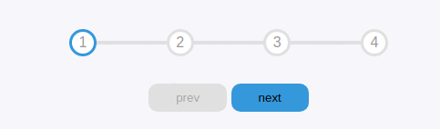

# Progress steps

> This is project is about building a progress bar when a user clicks next the bar moves to the next number up untill there is no next number then the next button gets disabled this logic also takes effect with the prev button.



## Live link
[will update]()

Additional description about the project and its features.

## Built With

- Major languages
- HTML
- CSS
- JS


## Getting Started

**To get a copy of this repo into your local machine run the following command:**
```
git clone git@github.com:Tchilo/50-days-project.git 

cd 50-days-project

switch the branch 

git checkout Day-2

open Visual studio code 

in visual studio code you can click the go live button to view it live in the browser.
```

## Author

👤 **Taro Chilongoshi**

- GitHub: [@Tchilo](https://github.com/Tchilo)


## 🤝 Contributing

Contributions, issues, and feature requests are welcome!

Feel free to check the [issues page](../../issues/).

## Show your support

Give a ⭐️ if you like this project!


## 📝 License

This project is [MIT](./MIT.md) licensed.
